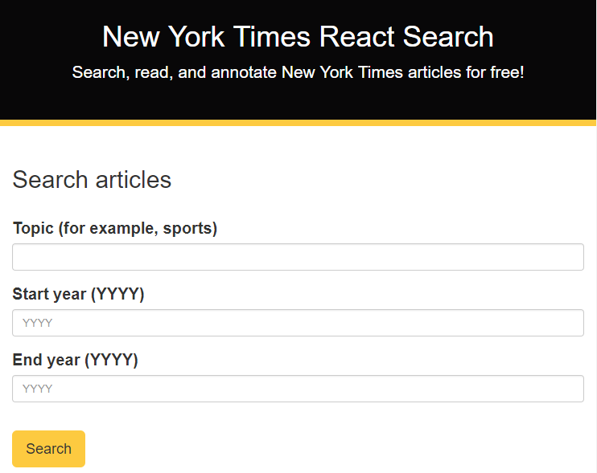
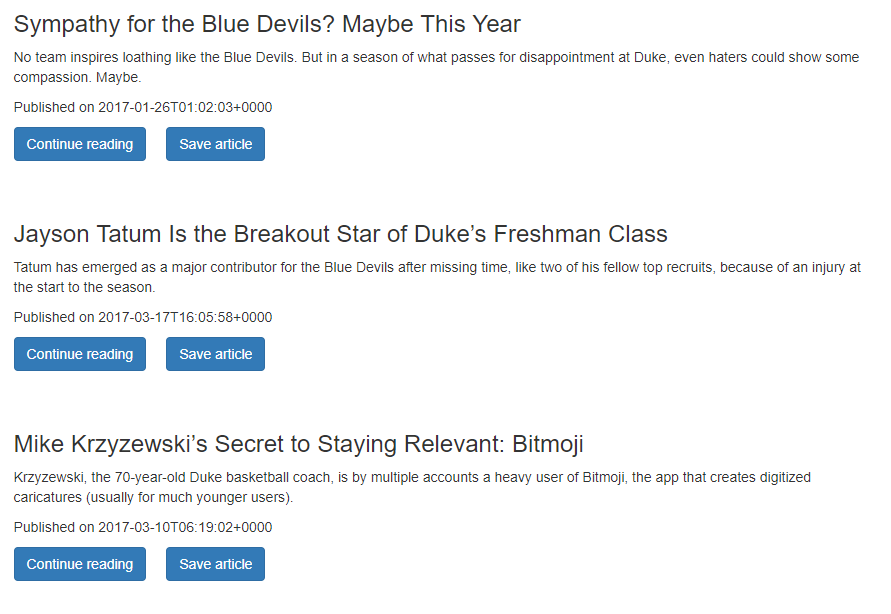

# New York Times React Search

A React application that uses the New York Times Article Search API to retrieve news articles by topic and year.

This project was bootstrapped with [Create React App](https://github.com/facebookincubator/create-react-app).

You can find the most recent version of this guide [here](https://github.com/facebookincubator/create-react-app/blob/master/packages/react-scripts/template/README.md).

## Table of contents

* [Live](#live)
* [Screenshots](#screenshots)
* [About this project](#about-this-project)
* [Getting started](#getting-started)
* [Deployment](#react-deployment)
* [Technologies used to create app](#technologies-used)
* [Direction for future development](#future)
* [Issues](#Issues)

## Live

<https://react-nytimes-search.herokuapp.com/>

##  Screenshots

 
 

##  About this project

* [How the app works](#how-app-works)
* [How the app is built](#how-the-app-is-built)

###  How the app works

When you navigate to the app home page, you will see an article search form with three input fields. Enter the topic you want to search for in the <b>Topic</b> field (for example, Grayson Allen), a start year (for example, 2017) in the <b>Start year</b> field, and an end year (for example, 2018) in the <b>End year</b> field. After you provide that information, click <b>Search</b>. When you click <b>Search</b>, a list of articles about your topic from the years specified will be retrieved using the New York Times Article Search API. If you want to read the entire article, click <b>Continue reading</b>, which is an external link that takes you to the full length article on the New York Times website.

In a future version of the app, you will be able to save articles that you like, leave comments on saved articles, and delete articles. Stay tuned...

###  How the app is built

This project was built using React, which is an open-source Javascript library developed at Facebook specifically for the task of developing user interfaces. React relies on a component-based architecture where elements of the user interface are broken into self-contained components.

For a high level overview of React, check out this video: <https://www.youtube.com/watch?v=x7cQ3mrcKaY>.

The React documentation is available at <https://reactjs.org/>.

For more information on how this project is structured and broken into various components, see [Structure of the project](#structure-of-project).

The app also uses the New York Times Article Search API to retrieve news articles from the New York Times. For more information about this API, see the [Article Search API documentation](https://developer.nytimes.com/article_search_v2.json#/Documentation/GET/articlesearch.json).

##  Getting started

The following section will take you through the steps of setting up this application and getting it running locally on your computer.

If you don't want to set up this project locally and just want to see the deployed application, go to <https://react-nytimes-search.herokuapp.com/>.

To set up this application locally on your computer, perform the following steps:

1. [Clone the repository](#clone-repository)

2. [Install Node.js](#install-node)

3. [Install yarn](#install-yarn)

4. [Install the dependencies](#dependencies)

5. [Install MongoDB](#install-mongo)

6. [Start the daemon for MongoDB](#mongod)

7. [Start the MongoDB shell](#mongoshell)

8. [Install Robo 3T](#install-robo)

9. [Seed the database](#seed)

10. [Start the Express server and React development server](#start-server)

###  1. Clone the repository

The first step is to clone the project repository to a local directory on your computer. To clone the repository, run the following commands:
<pre>
  git clone https://github.com/philipstubbs13/NYT-React-Search.git
  cd NYT-React-Search
</pre>

####  Structure of the project

After you clone the repository, navigate to the project root directory (NYT-React-Search). The project directory structure is set up as follows:

* <b>client</b>
  * <b>build</b>: This folder contains a build of the app optimized for production use. This folder will only appear within the project root directory if you kicked off a production build by running <b>yarn build</b>. If you haven't created a production build yet, then this folder will not be visible within the project root directory.
  * <b>node_modules</b>: This folder contains the project dependencies. It is ignored by git when committed to GitHub and Heroku. You install the project dependencies by running <b>yarn install</b> from the project root directory and from the <b>client</b> directory.
  * <b>public</b>: The public folder contains the index.html file. This HTML file is a template. The file is empty. So, if you open it directly in a browser, you will get an empty page. Rather than placing the HTML code directly in index.html, this app uses a React component-based architecture to create, build, and render UI components to the page. This folder also contains the favicon that is displayed on the browser tab.
  * <b>src</b>: The src folder is where the React app components reside.
    * <b>index.js</b>: The index.js file is the top level file of the React app. In index.js, the App.js file is imported, and the ReactDOM.render method is used to render App.js to the page.
    * <b>App.js</b>: The App.js file is where the React components are imported and rendered and where the routes are set up.
    * <b>components</b>: The components folder is where the app components that are reused across the app are located. Each folder represents a separate component. For example, Jumbotron is the Bootstrap Jumbotron component, which displays at the top of the app.
    * <b>containers</b>: Contains the pages of the app.
    * <b>utils</b>: Contains axios request to grab New York Times articles from the New York Times using the New York Times Article Search API. This folder also contains the axios requests used to get, save, and delete articles from the MongoDB database.
    * <b>App.css</b> and <b>index.css</b>: The external css stylesheets for the app.
  * <b>package.json</b>: Lists the project dependencies and their version numbers.
  * <b>yarn.lock</b>: Dependency tree for the project. Lists all the client dependencies and their versions.
* <b>controllers</b>: The controllers are the routes that are used to pass information to and from the view and model objects.
* <b>models</b>: A model defines the database schema or structure of the database.
* <b>readme_images</b>: Contains the screenshots used within the project README file.
* <b>routes</b>: These files are the key to how the back end and front end can communicate with each other. They give the server a map of how to respond when users visit or request data from various URLs.
* <b>scripts</b>
  * <b>build.js</b>: Run <b>yarn build</b> in the project root directory to create a production build of the app, which you can use to deploy the app to Heroku.
  * <b>seedDB.js</b>: Run <b>yarn seed</b> to populate your development database with information.
  * <b>start-client</b>: Script used to start the React development server.
* <b>.gitignore</b>: Anything listed inside this file (for example, node_modules) will not be tracked by GitHub or Heroku when code is committed.
* <b>package.json</b>: Lists the project dependencies and their version numbers. It also contains various scripts to start the server, create a production build, seed the database, etc.
* <b>Procfile</b>: This file tells Heroku to run the server file with node once it's built.
* <b>server.js</b>: This file does the following:
  * Defines and requires the dependencies, including express, body-parser, and mongoose.
  * Sets up the Express server to handle data parsing using body-parser.
  * Points the server to the API routes, which gives the server a map of how to respond when users visit or request data from various URLs.
  * Defines the port the server is listening on.
  * Starts the Express server and React development server.
  * Allows the app to serve static content.
  * Uses Mongoose (orm) to connect to MongoDB, which allows us to have access to the MongoDB commands to perform various operations on the database.
* <b>yarn.lock</b>: Dependency tree for the project. Lists the project dependencies and their versions.

###  2. Install Node.js

If you don't already have Node.js installed on your computer, you can install the latest version here: https://nodejs.org/en/.

###  3. Install yarn

To be able to install the dependencies and start the application locally, you will need to install yarn. Yarn is a package manager like npm.

To install yarn, run the following command:
<pre>
  npm install -g yarn
</pre>

For more information about yarn and other installation options, see the yarn documentation: <https://yarnpkg.com/en/>.

###  4. Install the dependencies

The following packages are dependencies to the project.

<ul>
	<li><b>express</b> -  a Node.js web application framework (https://www.npmjs.com/package/express).</li>
	<li><b>body-parser</b> - a package used to parse incoming request bodies in a middleware. (https://www.npmjs.com/package/body-parser)</li>
  <li><b>axios</b> - a promise based HTTP client for the browser and node.js (https://www.npmjs.com/package/axios)</li>
  <li><b>mongoose</b> - an ORM that allows you to connect to your MongoDB database and allows you to have access to the MongoDB commands to perform create, read, update, and delete operations on the database (https://www.npmjs.com/package/mongoose).</li>
  <li><b>react</b> - package for accessing React (https://www.npmjs.com/package/react)</li>
  <li><b>react-dom</b> - serves as the entry point of the DOM-related rendering paths (https://www.npmjs.com/package/react-dom).</li>
  <li><b>react-router-dom</b> - a third party routing library (https://www.npmjs.com/package/react-router-dom)</li>
  <li><b>react-scripts</b>: package that includes scripts and configuration used by Create React App. (https://www.npmjs.com/package/react-scripts)</li>
  <li><b>reactstrap</b> - library of Bootstrap UI components for React (https://reactstrap.github.io)</li>
</ul>

Version information for each of these packages is available in the <b>package.json</b> file in the project root directory and in the <b>client</b> directory.

After you clone the repository to a local directory, change directory to the project root directory and run the following command to install the required packages:

<pre>yarn install</pre>

Change directory to the <b>NYT-React-Search/client</b> directory and run the following command to install the client dependencies.

<pre>yarn install</pre>

###   5. Install MongoDB

For installation instructions, see <a href="https://github.com/philipstubbs13/coding-tips-tricks-resources/blob/master/MongoDB/Installing-MongoDB.md">Installing MongoDB</a>.

###   6. Start the daemon for MongoDB

Open another terminal window and run the following command to start the daemon process for MongoDB, which handles data requests, manages data access, and performs background management operations.

<pre>mongod</pre>

<b>Note:</b> You want to keep the mongod process running in the background during development.

###   7. Start the MongoDB shell

In a separate terminal window, run the following command to start up the MongoDB shell.

<pre>mongo</pre>

###   8. Install Robo 3T

If you don't already have Robo 3T installed on your computer, you can install the latest version <a href="https://robomongo.org/download">here</a>.

For this project, Robo 3T is similar to MySQL Workbench (if you are used to working with MySQL databases). Robo 3T is not required. But, similar to MySQL Workbench, it is a graphical user interface that is used to visually see the database and database collections (as opposed to using the command line interface for MongoDB).

###  9. Seed the database.

Run the following command from the project root directory (NYT-React-Search) to populate your local development database with dummy data.

<pre>yarn seed</pre>

### <a name="start-server"> 10. Start the Express server and React development server.</a>

After performing all of the setup steps in the <b>Getting started</b> section, navigate to the project root directory (NYT-React-Search) and run the following command to start the Express server and React development server:

<pre>
yarn start
</pre>

After the development server has started, a Chrome browser window should open, and you should see the application. If the browser does not automatically open after the server starts, you can verify that the application is working locally on your computer by manually opening Chrome and going to <a href="http://localhost:3000">http://localhost:3000</a>.

<b>Tip</b>: If you are still unable to see the application in the browser at <a href="http://localhost:3000">http://localhost:3000</a>, ensure that no other applications/processes are using port 3000. If port 3000 is in use by another process, kill that process and then restart the servers.

##  Deployment

This app is deployed to Heroku. To deploy the app, you will need to build a production version of the app as well as have Heroku CLI installed.

1. Download and install the Heroku CLI. You can install the Heroku CLI <a href="https://devcenter.heroku.com/articles/heroku-cli">here</a>.

2. If you haven't already, log in to your Heroku account and follow the prompts to create a new SSH public key.
<pre>heroku login</pre>

3. Change directory to the project root directory (<b>NYT-React-Search</b>).

4. If you have deployed the app before, delete the <b>NYT-React-Search/client/build</b> folder.

5. Run the following command to build a clean production version of the app.
<pre>yarn build</pre>

This command creates a folder called <b>build</b> inside of the <b>client</b> folder. 

6. Deploy your changes
<pre>
git add .
git commit -am "heroku commit message"
git push heroku master
</pre>

If you run into any issues with deploying the app to Heroku, run the following command in the project root directory to see the Heroku logs.

<pre>heroku logs</pre>

##  Technologies used to build app

* HTML
* CSS
* reactstrap (<https://reactstrap.github.io/>)
* Javascript
* React (<https://reactjs.org/>)
* Node.js (<https://nodejs.org/en/>)
* MongoDB (<https://www.mongodb.com/>)
* Express (<http://expressjs.com/>)
* Mongoose ORM (<http://mongoosejs.com/>)
* New York Times Article Search API (<https://developer.nytimes.com/article_search_v2.json#/Documentation/GET/articlesearch.json>)

##  Direction for future development
Source code will be developed over time to handle bug fixes and new features.

The following is a list of potential enhancements for future code development.

* Add feature to save articles to a MongoDB database.

* Add second page to the app that allows users to see saved articles.

* Add feature that allows users to leave comments on saved articles.

* Add feature that allows users to delete saved articles.

##  Issues

If you find an issue while using the app or have a request, <a href="https://github.com/philipstubbs13/NYT-React-Search/issues/" target="_blank">log the issue or request here</a>. These issues will be addressed in a future code update.
